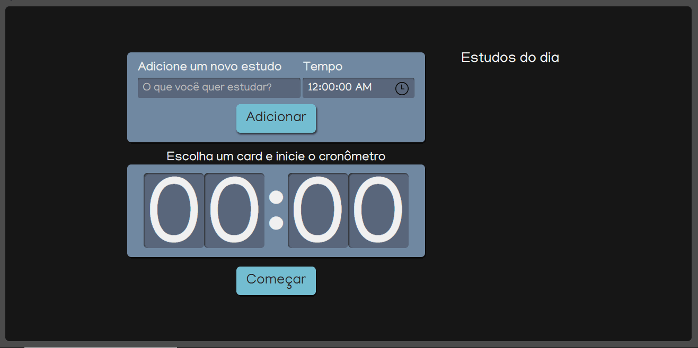
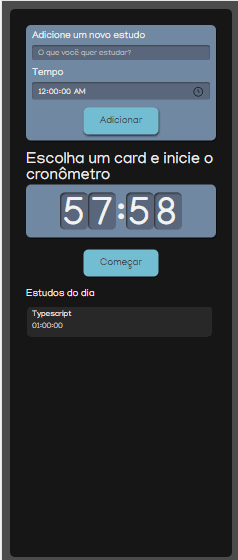

# alura-studies

"Alura Studies", na qual poderemos adicionar as tarefas que desejamos estudar e o tempo dedicado a esses estudos. Por exemplo, vou adicionar um novo estudo "React" com o tempo de 2 segundos, e outro, "Typescript", com 5 segundos.

Adicionando essas tarefas, elas vão para uma lista onde será possível selecioná-las. Selecionado "React", o tempo dessa tarefa vai diretamente para um cronômetro, que passará a mostrar "00:02". Se eu adicionar o Typescript, o valor mudará para "00:05". Depois que essa tarefa vai para o cronômetro, eu consigo inciá-la com o botão "Começar", que ativará o temporizador. Quando o tempo chegar a zero, a tarefa será completada e não será mais possível clicar sobre ela. Esse será o nosso ecossistema.

Para conseguirmos criar essa aplicação, primeiramente entenderemos como criar um projeto React com o create react app, além de aprender o que ele nos traz em questão de estrutura de pastas.

Também aprenderemos o conceito de componentização, o principal que o React nos traz. Em nossa aplicação, todos os elementos, como o formulário, o botão, a lista, os itens e o cronômetro, são componentes distintos. Aprenderemos a criá-los da maneira antiga, com os Class components, e de uma nova forma com os Function components.

Criando esses componentes, aprenderemos dois conceitos muito importantes. O primeiro deles é o DRY - Don't Repeat Yourself, ou "não se repita" em português, muito usado no React. A ideia é que não é necessário repetir códigos, já que a criação de componentes permite reaproveitá-los em outras instâncias - por exemplo, usaremos o nosso botão tanto no formulário quanto no cronômetro, alterando apenas o texto que é mostrado e o evento acionado no clique. Dessa forma, reaproveitaremos o CSS e a estrutura HTML desse botão.

Outro conceito é o chamado SRP - Single Responsibility Principle, traduzido para "Princípio da Responsabilidade Única". De forma simplificada, cada função do seu código deve ter uma responsabilidade. Em nosso caso, como o function component é uma função e um componente, cada componente deverá ter apenas uma responsabilidade. Usaremos bastante esse princípio ao criarmos nosso cronômetro.

Também usaremos Sass para conseguirmos fazer o CSS mais rápido, e Css Modules para não termos o problema de sobreposição de CSS de um componente para outro. Também aprenderemos sobre comunicação entre componentes com o Props, e sobre o estado interno de um componente com o State.

Caso você seja um veterano em React, também analisaremos como funciona uma transição/refatoração de um Class component, uma forma antiga, para um Function component, que é uma forma mais atual de se escrever React, entendendo a diferença deles, o motivo do Function component ser priorizado, entre outras coisas

## WEB

## MOBILE

